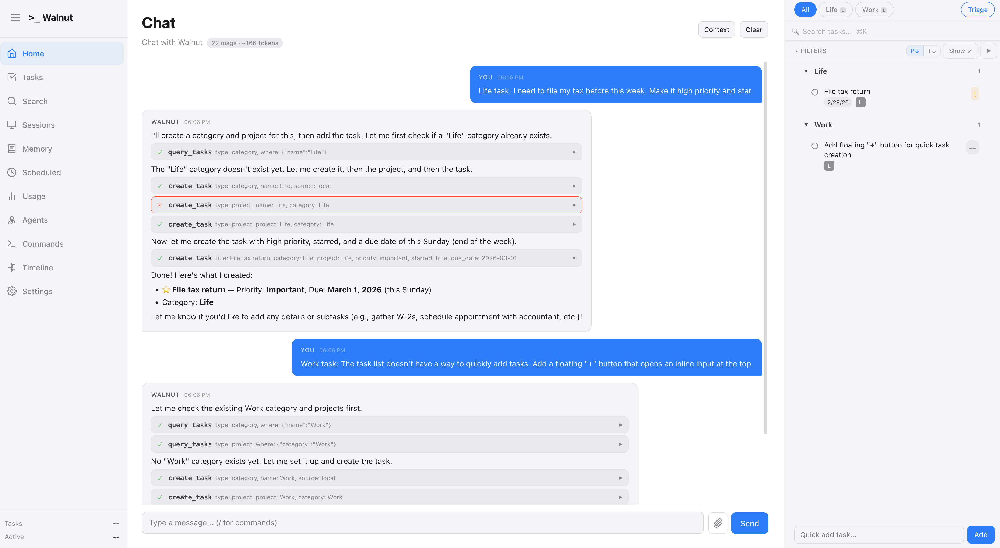
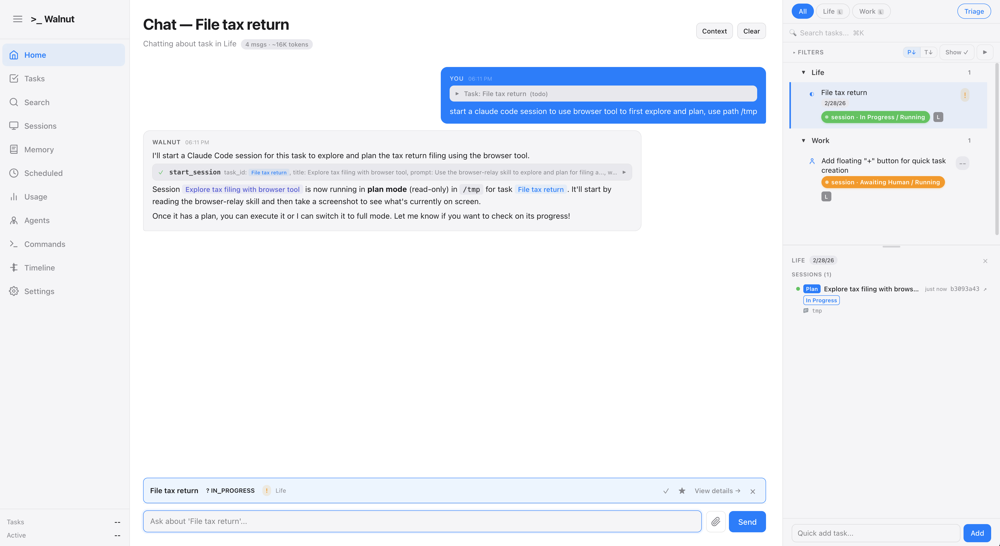

# Walnut

**A local-first personal AI butler that tracks your entire life — work projects, personal tasks, appointments, finances, knowledge — and manages AI agent sessions on your behalf.**

Everything runs on your machine. Your data stays in `~/.walnut/`. No cloud accounts, no third-party databases, no telemetry. You own it all.

## What It Does

Walnut is a single system that replaces scattered to-do apps, note-taking tools, and manual AI workflows. You talk to it in natural language, and it:

- **Creates and manages tasks** across your entire life — work projects, personal errands ("file my taxes"), recurring appointments, side projects, anything.
- **Spawns AI coding sessions** attached to tasks — Claude Code sessions that run autonomously, report back when done, and store their output alongside the task.
- **Builds a memory** of everything — per-project knowledge files, daily logs, session summaries. Full-text search and vector search across all of it.
- **Syncs with external tools** — Microsoft To-Do, Jira, and any custom integration via the plugin system. Changes flow both ways.
- **Runs on a schedule** — cron jobs, daily checklists, recurring reminders. The agent handles them and only notifies you when something needs your attention.

You interact through a web UI or CLI. The AI agent has 30+ tools and full context about your tasks, memory, sessions, and integrations. It doesn't just answer questions — it takes action.

## Screenshots

### Talk to the agent, get things done



> "I need to file my tax before this week. Make it high priority and star."
>
> Walnut creates the category, project, and task — sets priority, due date, and star — in one shot.

### AI sessions that work for you



> The agent spawns a Claude Code session attached to the task. It runs in plan mode, reports progress, and you can check on it anytime from the session panel.

## Features

### Task Management
- 4-layer hierarchy: **Category > Project > Task > Subtask**
- Priorities, phases (7-state lifecycle), dependencies, due dates, starring
- Task dependencies with cycle detection
- Quick-add from the UI or natural language through chat

### AI Agent
- 30+ tools: create/update/query tasks, read/write memory, spawn sessions, search, manage cron jobs, and more
- Full context window: the agent sees your tasks, memory, active sessions, and integrations
- Manages Claude Code sessions — starts them, monitors progress, captures output
- You get notified when a session finishes or needs input. Otherwise it works silently.

### Memory System
- Per-project markdown files at `~/.walnut/memory/projects/{category}/{project}/`
- Daily logs, session summaries, and manual notes
- SQLite FTS5 full-text search + BGE-M3 vector search (via local Ollama)
- The agent reads and writes memory as it works — knowledge accumulates over time

### Integrations
- **Microsoft To-Do** — two-way sync of tasks, phases, priorities, notes
- **Jira** — sync with Jira issues via the plugin system
- **Git-sync** — auto-commit `~/.walnut/` data to a git repo for backup
- **Plugin system** — drop a plugin into `~/.walnut/plugins/` with a `manifest.json` and implement the `IntegrationSync` interface

### Sessions
- Spawn Claude Code sessions from any task via the Claude Agent SDK
- Plan mode (investigate first, then execute) or bypass mode (execute immediately)
- Session output tracked in the task panel — conversation history, tool calls, status
- Multi-session support with a 2-slot model per task
- Remote session support via SSH

### Scheduling
- Cron jobs with natural language or cron expressions
- Heartbeat checklists — daily/weekly markdown checklists the agent runs through
- The agent responds to triggers autonomously and logs the results

### Web Dashboard
- Task board with filters, search, categories, and project tabs
- Session viewer with real-time streaming
- Memory browser and editor
- Context inspector — see exactly what the agent sees
- Usage tracking and cost breakdown
- Timeline view

### Local-First
- All data in `~/.walnut/` — plain JSON, markdown, and SQLite files
- No external database, no cloud dependency for core functionality
- Integrations (To-Do, Jira) are optional plugins
- Runs as a local Express server on your machine

## Quick Start

```bash
git clone https://github.com/EvanZhang008/walnut.git
cd walnut
npm install       # installs backend + frontend dependencies
npm start         # builds everything and starts on http://localhost:3456
```

Open [http://localhost:3456](http://localhost:3456) in your browser.

### Prerequisites

- **Node.js** >= 22
- **AWS credentials** for Claude via Bedrock (or configure another provider in `~/.walnut/config.yaml`)
- **Ollama** (optional) — enables local vector search for memory

## Configuration

All configuration lives in `~/.walnut/config.yaml`:

```yaml
# AI model
model: claude-sonnet-4-20250514
aws_region: us-west-2

# Microsoft To-Do (optional)
plugins:
  ms-todo:
    enabled: true
    client_id: YOUR_AZURE_AD_CLIENT_ID

# Heartbeat checklists (optional)
heartbeat:
  enabled: true
```

Run `walnut auth` to set up Microsoft To-Do OAuth.

External plugins (Jira, custom integrations) go in `~/.walnut/plugins/{plugin-name}/`.

## Project Structure

```
src/
  agent/          # AI agent: 30+ tools, context builder, loop, caching
  commands/       # CLI commands (start, chat, tasks, sessions, web, ...)
  core/           # Data layer: task-manager, memory, sessions, cron, config
  heartbeat/      # Daily/weekly checklist runner
  hooks/          # Lifecycle hooks (on-compact, on-stop)
  integrations/   # Built-in plugins (MS To-Do, git-sync, tmux)
  logging/        # Structured logger with redaction
  providers/      # Session providers (Claude Code SDK, SSH, subagent)
  session-server/ # Multi-session server via Claude Agent SDK
  utils/          # Shared utilities
  web/            # Express server, REST API, WebSocket
web/              # React frontend (Vite + TypeScript)
tests/            # Unit, integration, e2e, and Playwright browser tests
```

See [ARCHITECTURE.md](./ARCHITECTURE.md) for the full system design.

## Development

```bash
npm run dev           # Watch mode (backend only)
npm run web:dev       # Full dev mode with frontend HMR
npm run lint          # TypeScript type check
npm test              # Run all tests
npm run test:unit     # Unit tests only
npm run test:e2e      # End-to-end tests
```

| Command | Description |
|---------|-------------|
| `npm start` | Build and start production server on port 3456 |
| `npm run web:dev` | Dev mode with hot reload |
| `npm run web:build` | Production build |
| `npm test` | Run all tests |
| `npm run lint` | TypeScript type check |

## Tech Stack

- **Backend**: Node.js, Express, TypeScript, better-sqlite3
- **Frontend**: React, Vite, TypeScript
- **AI**: Anthropic Claude via AWS Bedrock, Claude Agent SDK
- **Search**: SQLite FTS5 + BGE-M3 embeddings (Ollama)
- **Testing**: Vitest, Playwright
- **Integrations**: Microsoft Graph API, Jira, plugin system

## License

MIT
