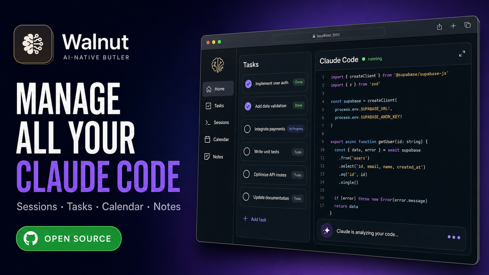
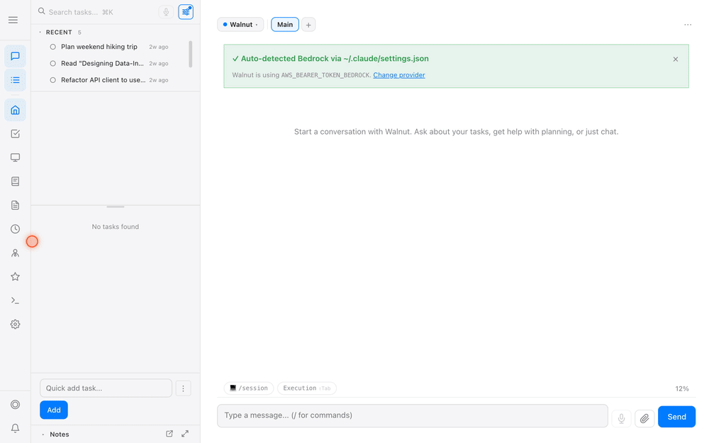
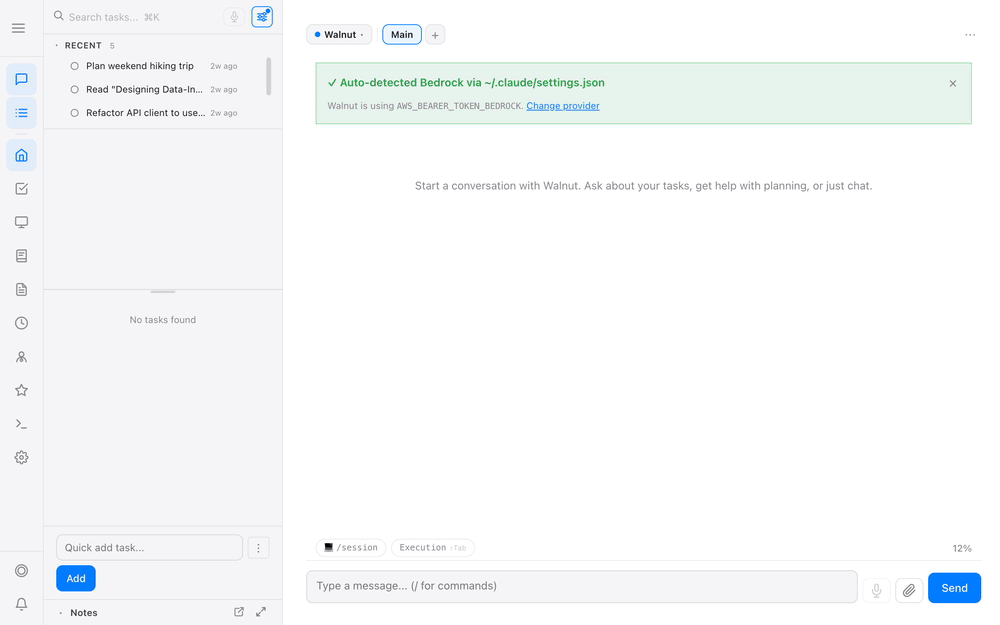
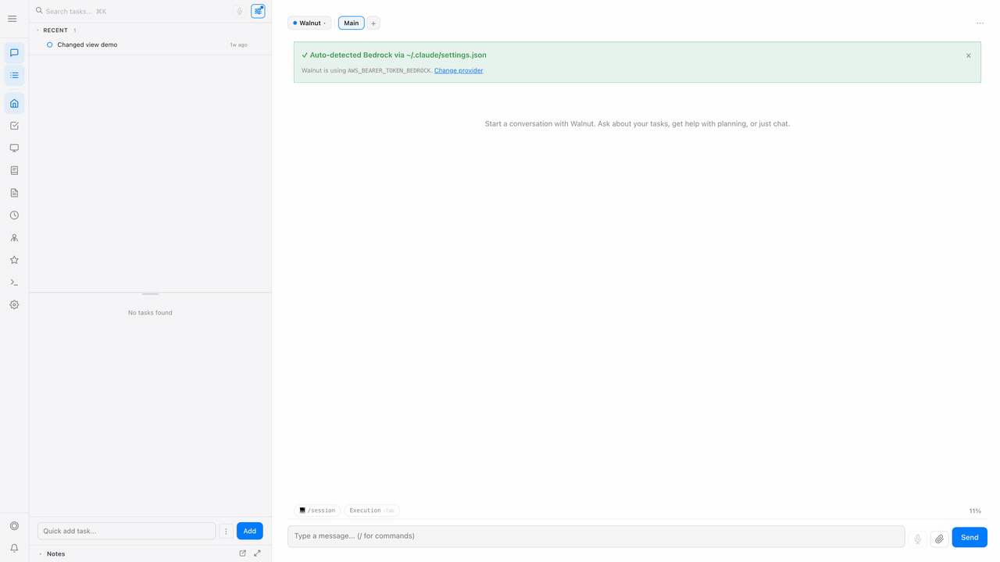
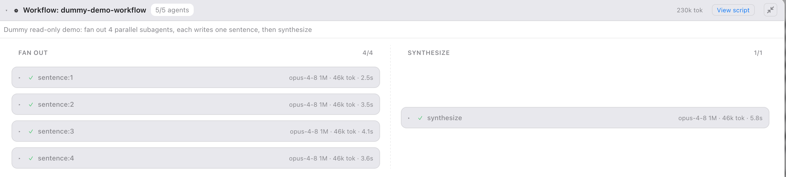
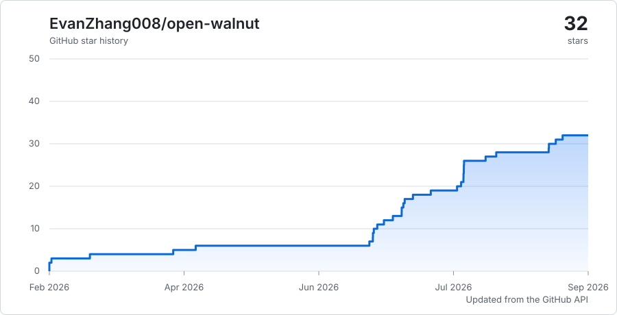

# Open Walnut - Your Personal AI

[](LICENSE)
[](https://github.com/EvanZhang008/open-walnut/actions)
[](https://nodejs.org/)
[](https://www.typescriptlang.org/)
[](https://github.com/EvanZhang008/open-walnut)

[](https://youtu.be/uN4WCZ-n2mw)

<p align="center"><b><a href="https://youtu.be/uN4WCZ-n2mw">Watch the 3-minute demo</a></b></p>

Open Walnut is a self-hosted home for your AI work. It brings your personal AI, Claude
Code sessions, tasks, notes, and long-term memory into one web app.

Use Walnut to plan work, organize tasks, find context in your notes and memory, and
start coding sessions. Run Claude Code on your laptop or remote SSH hosts, follow
multiple sessions from one browser, and review every file they change. Open Walnut is
local-first, self-hosted, and has no telemetry.

## What Open Walnut Does

- **Personal AI**: Ask Walnut to manage tasks, find information, write and search
  notes, start coding sessions, and run scheduled routines.
- **Claude Code workspace**: Run and monitor multiple Claude Code sessions side by side
  with live output, permission controls, terminals, files, and session history.
- **Local and remote sessions**: Use the same web app for sessions on your laptop and
  any configured SSH host.
- **Durable sessions**: Sessions keep running across browser disconnects, dropped SSH
  connections, and Walnut server restarts.
- **Change review**: Inspect a per-session diff, comment on individual lines, and send
  the review back to the same session.
- **Tasks and projects**: Organize work as `Project -> Task -> Subtask`, with an Inbox
  for tasks that do not belong to a project.
- **Notes and memory**: Keep Markdown notes with wiki links and search them together
  with task, session, and memory data.
- **Local-first storage**: Core data is stored under `~/.open-walnut/` in JSON, YAML,
  Markdown, and SQLite files.

## Quick Start

### Requirements

- Node.js 22 or newer. If you don't have it: `curl -o- https://raw.githubusercontent.com/nvm-sh/nvm/v0.40.3/install.sh | bash` then `nvm install 22`.
- git, only for the checkout route below (macOS: `xcode-select --install`, Ubuntu: `sudo apt install git`)
- Linux: a C library from 2019 or later (glibc 2.29+: Ubuntu 20.04+, Debian 11+, AL2023, Fedora). Older distros compile one native module and need a newer Python and GCC first; `npm start` prints the exact commands, and [Getting Started](GETTING_STARTED.md#older-linux-glibc-before-229) has them too.
- [Claude Code](https://docs.anthropic.com/en/docs/claude-code), signed in once (`npm install -g @anthropic-ai/claude-code`, then run `claude`)

That is the whole AI setup. Walnut runs on your Claude Code: the chat, coding sessions, and background work (summaries, titles, subagents) all use the `claude` you already have, however it signs in (Anthropic account, Bedrock, or Vertex). An Anthropic API key or AWS Bedrock credentials are optional, for people who would rather point Walnut's background work at a provider directly (Settings → AI Provider).

### Install

The published package is the quickest way in. Nothing to build, and it starts in a few
seconds:

```bash
npm install -g open-walnut
open-walnut web
```

To work on Walnut itself, run it from a checkout instead:

```bash
git clone https://github.com/EvanZhang008/open-walnut.git
cd open-walnut
npm install
npm start
```

Open [http://localhost:3456](http://localhost:3456) and follow the setup screen. The
first start downloads the default local embedding model, Qwen3-Embedding-0.6B
(approximately 640 MB), in the background.

For provider options, remote hosts, and troubleshooting, see
[Getting Started](GETTING_STARTED.md).

### Set Up with Claude Code

If Claude Code is already configured on your machine, you can ask it to install and
verify Open Walnut. Paste this into an authenticated Claude Code session:

```text
Set up Open Walnut for me: read and run the skill at
https://github.com/EvanZhang008/open-walnut/blob/main/skills/setup-walnut/SKILL.md
```

The skill mirrors your existing provider setup, installs dependencies, starts Walnut,
and verifies the connection with a real model request. Review the
[setup skill](skills/setup-walnut/SKILL.md) for the exact steps.

## Product Tour

### Start a Session from a Prompt

Choose a working directory, describe the work, and start a Claude Code session. The
task stays attached to the session while its output streams in the browser.


### Use Claude Code from the Browser

Chat with Claude Code, change its mode or model, open a terminal, browse files, inspect
history, and fork the session without leaving the page.


### Keep Work in One View

The home page combines tasks, Walnut, and Claude Code session columns. You can move
between planning, execution, and review without rebuilding context in another app.



### Set Your Active Work

Move pinned tasks between Focus, Satellite, and Wait to show what needs attention now,
what can run in parallel, and what is blocked.



### Search Notes and Memory

Write Markdown notes with wiki links and backlinks. Walnut can search notes and memory
through local keyword and vector indexes.


### Review Session Changes

Open the Changed view to inspect the files edited by one session. Select code or leave
line comments, then send the review back to that session.



## Local and Remote Sessions

Open Walnut uses the same session system for local and remote work. A small daemon on
each host owns the long-running Claude Code processes, while the web app connects to
those daemons.


- A session keeps running if the browser, SSH tunnel, or Walnut server disconnects.
- When Walnut reconnects, it finds the existing process and restores its history from
  the on-disk session log.
- Walnut deploys and updates its daemon over SSH. No manual copy step is required.
- Chat, terminal access, files, diffs, commands, and skills work on remote hosts.

Add remote hosts to `~/.open-walnut/config.yaml`:

```yaml
hosts:
  my-server:
    hostname: dev.example.com
    user: myuser
    # Optional: identity_file, port, shell_setup
```

See [Remote sessions via SSH](GETTING_STARTED.md#remote-sessions-via-ssh) for the full
setup.

## Change Review and Workflows

The Changed view reconstructs a diff from the selected session's own history rather
than the repository's current Git state. This keeps edits attributed to the correct
session when several sessions share a repository.

- View changes as a split or unified diff.
- Select code and ask the session about it.
- Add line comments and send them as one review.
- Group changes by repository when a session works across several repositories.

Open Walnut also displays dynamic Claude Code workflows as a live graph. Each node
shows a subagent's status, model, token use, and duration. Select a node to read its
transcript or inspect the script that created the workflow.



The graph is restored from its on-disk manifest after a reload or reconnect.

## Tasks, Notes, and Memory

### Tasks

Tasks are the main unit of work in Open Walnut.

- Projects group related tasks; unassigned tasks stay in the Inbox.
- Tasks can contain subtasks, priorities, due dates, dependencies, tags, and notes.
- Session activity updates task progress, while final completion remains a human
  decision.
- The task board supports search, filters, bulk actions, and drag-and-drop ordering.
- Optional plugins provide two-way sync with Microsoft To-Do and Jira.

### Notes

The notes workspace supports Markdown, `[[wiki-links]]`, backlinks, folders,
attachments, slash commands, and rich editing. Notes remain ordinary files under
`~/.open-walnut/notes/`.

Walnut can search your notes, and `notes/AGENTS.md` can provide shared instructions to
Claude Code sessions.

### Memory

Walnut records useful context in daily logs, project memory, repository memory, and
session summaries. A background consolidation job updates topic pages so important
context remains easy to find without loading every old conversation.

Search combines BM25 keyword matching, local vector embeddings, optional reranking,
and freshness weighting. Memory, notes, tasks, and sessions use separate indexes so
one source does not overwhelm the others.

## Automation and Extensions

- **Routines**: Run one-time, interval, and cron-based jobs from the Routines page.
- **Custom agents**: Create focused agents with separate conversations and memory.
- **Commands and skills**: Browse and run local or remote Claude Code commands and
  skills from the web app.
- **Task integrations**: Sync Microsoft To-Do and Jira through built-in plugins.
- **Custom plugins**: Install trusted Git or npm Plugins that add server logic, a native React App, Tools, Skills, Commands, Hooks, Agents, Providers, routes, and task sync without changing Walnut.
- **Notifications**: Send optional Slack notifications for important events.

### Writing a plugin

A plugin App joins the same App Registry as Walnut's own screens, so one `walnut.ui.app` registration gives it a Sidebar entry, the route `/apps/<plugin-id>~<app-id>`, deep links, a badge, and a Command Palette entry. Installing a plugin means trusting its code: a server entry is full Node, and a native web entry shares the console's React tree.

After the author packages reach npm, the whole first authoring loop is one command, which scaffolds, links into the running console, and reloads on every save. They are not published yet; the guide gives the equivalent local-checkout command available today.

```bash
npx @open-walnut/plugin-cli new my-plugin --dev
```

Read [Plugin development](docs/reference/plugin-development.md) for the full guide, and [examples/plugins/walnut-demo](examples/plugins/walnut-demo) (the Walnut Plugin Demo) for a runnable example of every public capability. The console also ships a guided onboarding page at `/plugins/new`.

## iOS Companion

The beta SwiftUI app provides access to tasks, notes, and live sessions from an iPhone.
It pairs with the web app by QR code. An optional self-hosted cloud companion can
connect the phone to your machines when you are away from your local network.

See [Cloud sync](docs/reference/cloud-sync.md) for the architecture and setup.

## Data and Privacy

- Core app data is stored locally under `~/.open-walnut/`.
- Open Walnut does not include telemetry or require an Open Walnut account.
- Model prompts are sent only to the provider you configure.
- Remote sessions connect only to hosts you configure.
- Cloud access, task integrations, Slack, and Git remotes are optional.
- Private plugins stay outside the repository.

## Web Pages

| Route | Purpose |
|---|---|
| `/` | Walnut, tasks, and Claude Code session columns |
| `/tasks` | Project and task workspace |
| `/tasks/:id` | Task details, subtasks, sessions, notes, and dependencies |
| `/notes` | Markdown notes workspace |
| `/memory` | Memory browser |
| `/calendar` | Calendar view |
| `/routines` | Scheduled routines and automation |
| `/agents` | Custom agents and their conversations |
| `/commands` | Claude Code commands |
| `/skills` | Claude Code and Walnut skills |
| `/settings` | Providers, integrations, repositories, usage, and app settings |
| `/apps/<plugin-id>~<app-id>` | A plugin App, mounted by the App Registry |

Sessions open as columns on the home page. Legacy `/sessions?id=...` links redirect
there automatically.

Walnut's own screens and every plugin App live in one App Registry, so they share the same Sidebar order, visibility, badges, and navigation. Home's Chat, Todo, and Agenda are Dock controls inside Home rather than separate apps.

## CLI

Both `walnut` and `open-walnut` invoke the same CLI.

```bash
walnut web [--port 3456]             # Start the web app
walnut add "Task title" --project X  # Create a task
walnut tasks [--status todo]         # List tasks
walnut projects                      # List projects
walnut done <id>                     # Complete a task
walnut sessions                      # List sessions
walnut start <task_id>               # Start a Claude Code session
walnut recall "query"                 # Search memory and tasks
walnut chat [question]               # Talk to Walnut
walnut logs [-f] [--json]            # Read structured logs
```

Use `walnut --help` for all commands and options.

## Configuration

Configuration is stored in `~/.open-walnut/config.yaml`. The Settings page covers model
providers, search, integrations, repositories, session hosts, usage, and other app
options.

Open Walnut supports Anthropic, AWS Bedrock, OpenAI-compatible APIs, Google Generative
AI, and Ollama. See [Getting Started](GETTING_STARTED.md#provider-configuration) for
provider examples.

## Project Structure

```text
src/
  agent/          # Personal AI loop, tools, providers, and context
  commands/       # CLI commands
  core/           # Tasks, memory, search, sessions, routines, and config
  integrations/   # Built-in task integrations
  logging/        # Structured logging and redaction
  providers/      # Claude Code sessions, daemons, and subagents
  web/            # Express server, REST API, and WebSocket handlers
web/              # React web app
ios-native/       # SwiftUI companion app
infra/            # Optional cloud companion infrastructure
docs/             # Design, decisions, investigations, and references
tests/            # Unit, integration, end-to-end, and browser tests
```

Read [Architecture](ARCHITECTURE.md) for the system design and the
[documentation index](docs/README.md) for deeper technical documentation.

## Development

```bash
npm run build                       # Build the server and session daemon
cd web && npx vite build            # Build the web app
npm run dev                         # Watch the server
cd web && npx vite                  # Run the web app with hot reload
npm run test:quick                  # Run the default fast test suite
npm run test:focus -- <test-path>   # Run focused tests
npm run lint                        # Type-check the server
```

The backend development server and Vite can also be started together with:

```bash
npm run web:dev
```

## Tech Stack

- Node.js, Express, TypeScript, and SQLite
- React, Vite, and TypeScript
- Anthropic Claude and other configurable model providers
- Claude Code CLI with stream-JSON I/O
- Built-in hybrid search: SQLite FTS5 keyword lanes plus local vector rescore
- Vitest and Playwright

## Star History

[](https://github.com/EvanZhang008/open-walnut/stargazers)

## Contributing

Contributions are welcome. Read [CONTRIBUTING.md](CONTRIBUTING.md) before opening a
pull request.

## License

[MIT](LICENSE)
