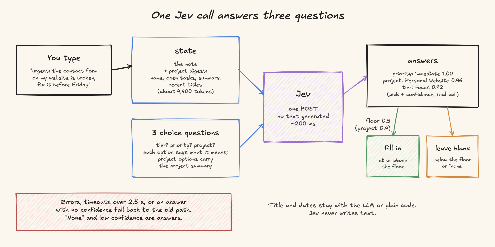
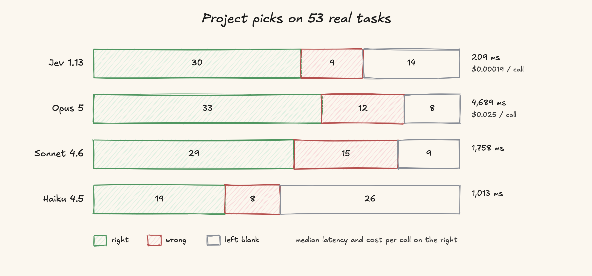

# Picking a New Task's Project in 200 ms: Jev vs Claude on 53 of My Tasks

## Introduction

[Open Walnut](https://github.com/EvanZhang008/open-walnut) is a self-hosted web app for running Claude Code sessions. Every session sits on a task, and the task board shows which sessions are running and which are waiting for you. When you type a new task, Walnut tries to fill in its project, priority and pinned tier while you are still typing.

Since September 2026 those guesses can come from Jev, a decision-only model from TypeSafe AI, instead of a Claude model. On 53 of my own tasks with a known project, Jev picked the wrong project 9 times and Claude Opus 5 picked it wrong 12 times. Jev answered in a median 209 ms against 4,689 ms, and a call cost about $0.00019 against $0.025. Opus got 3 more tasks right, because Jev leaves a field blank when it is not sure.

*Figure 1. A new task typed in Walnut. The dark panel is a recording overlay, not part of Walnut: it shows the one Jev call behind the pills.*

## Where these guesses run

Two paths create tasks without asking the user to file them:

- The draft composer. You type a note, and Walnut guesses the project, priority and tier so the task lands in the right place.
- Quick-start sessions. A session started without a project gets moved into its best match instead of staying in the Inbox.

Both run on every new task, so they need to be fast and cheap. They also need a way to leave a field blank. A wrong project hides the task in a list you are not looking at, which is worse than leaving it in the Inbox. The session path moves tasks with nobody watching and uses a stricter confidence floor.

## Version 1: a strict-JSON call on the fast model

The first version asked the configured fast model for a JSON object: a cleaned title, a tier, a priority and a project name picked from a digest of your projects. With an API provider this worked in about a second on Haiku 4.5.

Walnut can also run with no API key at all, using the Claude Code CLI as its only engine. There, every guess spawned a whole `claude -p` process. On 17 September 2026 I measured all 144 quick-parse calls on such a machine: every one hit its 10-second abort and returned nothing. Each pending call also held one of the browser's six connections to the server, and the rest of the page slowed down while it waited.

The LLM also put tasks in the `focus` and `wait` tiers more often than their text supported.

## Version 2: Jev

Jev does not generate text. One POST carries a text `state` and a set of typed questions. For a choice question it returns the picked option, a probability for every option, and a confidence number. The model never writes JSON, so there is no free-form output to parse or repair.

Through OpenRouter it is priced at $0.042 per million input tokens, and output is free. A quick-add call carries the note plus the project digest, about 4,400 tokens, and OpenRouter billed a median $0.00019 per call.

## The design

### One call, three questions

*Figure 2. The note and the project digest go out once; three answers come back, each with its own confidence.*

The state is the note followed by the project digest: each project's name, open task count, a short summary and some recent task titles. The call asks three choice questions at once: tier, priority and project. Each option in a question carries a sentence saying what it means.

The digest only lists the 20 projects with the most open tasks, but the project question offers every project. A project outside that window used to be a bare name with no evidence behind it. Notes about those quiet projects stayed in the Inbox. Now every option carries its project's summary (capped at 160 characters) inside the question itself.

### A confidence floor for each field

A Jev answer below its floor counts as "leave it blank". Tier and priority use 0.5. The project question uses 0.4, because about 50 options spread the probability thinner: 12 blanks on the 53-task set had the correct project as Jev's top pick, at confidence between 0.29 and 0.48. In an A/B run of the project question alone, moving the floor from 0.5 to 0.4 added 9 correct picks and 1 wrong one. It changed nothing on 92 to-dos from my to-do app, whose confidence sat either well above or well below that band.

Moving a quick-start session into a project uses 0.6.

### When Walnut falls back to the old path

Walnut treats "nothing fits" and a low-confidence answer as final and leaves the field blank. A network error, a malformed response, or an answer with no confidence number goes back to the old fast-model path and logs a warning. A change in the response format therefore cannot quietly switch the feature off.

The quick-add call has its own 2.5-second limit, so a slow endpoint cannot hold a browser connection after the rest of the parse has finished.

### What stays with the LLM

The title, dates and any new project name stay with the LLM or with plain code. When both run, they run in parallel, and Jev's confident answers replace the LLM's tier, priority and project. That includes clearing a `focus` or `wait` the LLM claimed when Jev is confident the task belongs in neither.

On a machine whose only engine is the Claude Code CLI, the LLM half is skipped. The title stays exactly as typed and Jev supplies the rest.

### The wording of the question

The first version of the project question opened with the case for "none": "One-off items (an errand, a call, a single reminder) belong to none." Generic bug notes such as "Panel scroll blocked at wide width" came back blank. The current wording says that bug reports, feature ideas and investigations almost always belong to the product project whose scope covers them, and saves "none" for personal errands and reminders.

With the new wording and the 0.4 floor together, the production path went from 22 right, 8 wrong and 23 blank to 30 right, 9 wrong and 14 blank.

## Results

The comparison ran on 53 tasks whose project I already knew. Jev went through the production `parseQuickTask` code on OpenRouter. The Claude models got the production quick-parse system prompt and the same digest on Bedrock. Only the project field is scored. A blank counts as neither right nor wrong. Three notes fit two projects equally well, and those count as wrong for every engine.

*Figure 3. Right, wrong and blank answers per engine on the same 53 tasks.*

| Engine | Right | Wrong | Blank | Right when it answered | Median latency | Cost per call |
|---|---:|---:|---:|---:|---:|---:|
| Jev 1.13 (OpenRouter) | 30 | 9 | 14 | 77% | 209 ms | $0.00019 |
| Claude Opus 5 | 33 | 12 | 8 | 73% | 4,689 ms | $0.025 |
| Claude Sonnet 4.6 | 29 | 15 | 9 | 66% | 1,758 ms | not measured |
| Claude Haiku 4.5 | 19 | 8 | 26 | 70% | 1,013 ms | not measured |

Jev's cost is the `usage.cost` OpenRouter returned, as a median over the 53 calls. The Opus cost comes from five calls measured with the same prompt: about 4,290 input and 130 output tokens at the list price of $5 and $25 per million, with no prompt caching, which is how the quick-add call runs.

A separate run on 21 September sent the 92 to-dos from my to-do app, which have no known answers, through that day's production path to check reliability. All 92 calls returned, with a median of 162 ms and a 95th percentile of 489 ms.

These numbers come from one person's projects and one set of 53 tasks. Jev made fewer wrong picks (9 against 12) and answered in a median 209 ms, fast enough to fill the fields while the note is still being typed.

## Lessons learned

**Count wrong answers and blanks separately.** Ranking by right answers alone puts Opus first, 33 to 30. Opus made 12 wrong picks to Jev's 9. A wrong pick files the task in a project the user is not looking at, while a blank leaves it in the Inbox.

**Choose each floor from a labelled set.** The 0.4 project floor came from scoring the project question on the same 53 tasks at 0.5 and at 0.4: 9 more right, 1 more wrong.

**Give every option its own evidence.** Projects outside the digest's top 20 were bare names until their summaries moved into the question, and notes about them stayed in the Inbox.

**Keep the old path intact.** Without a `jev:` section in the config, every call site runs its old code unchanged, and any Jev error falls back to it. So Jev shipped behind one setting, and the two paths could be compared on my own tasks.

## Where to start

Open Settings, then Tasks, then Smart task creation, and pick Jev under "Uses". Set Endpoint to `https://openrouter.ai/api/alpha/decisions` and Jev model to `typesafe/jev-1.13`, paste an OpenRouter key, and press "Test connection". The same settings can go in the config file as a `jev:` section. Then type a few tasks whose project you already know and check what lands in the Inbox.

The client is `src/core/decision/jev-client.ts`, the quick-add path is `src/core/quick-task-parse.ts`, and the full reference, including this table, is `docs/reference/jev-decisions.md`.
