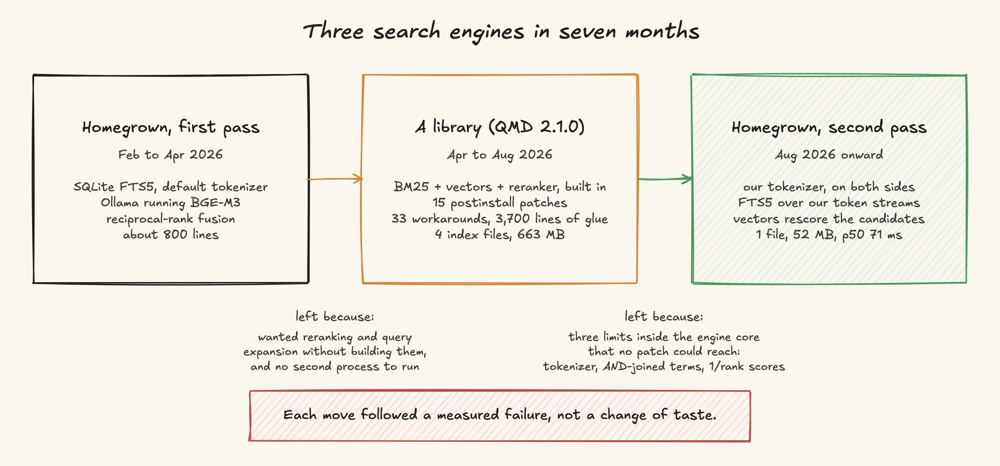
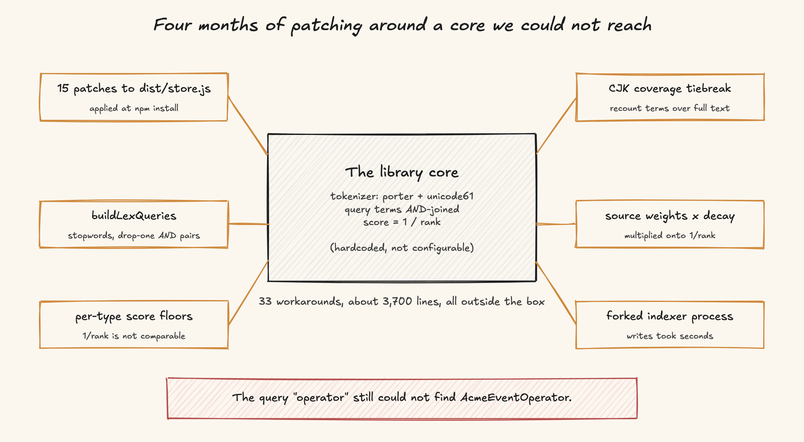
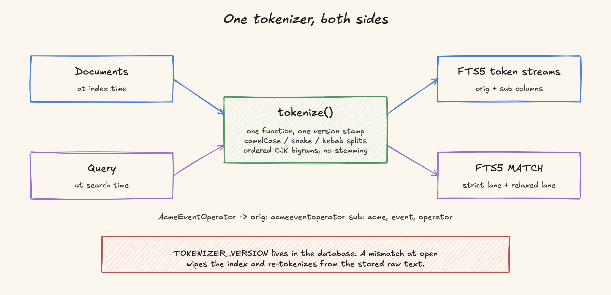
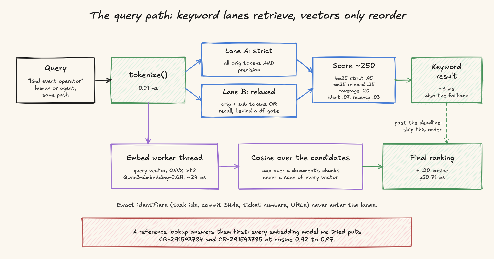
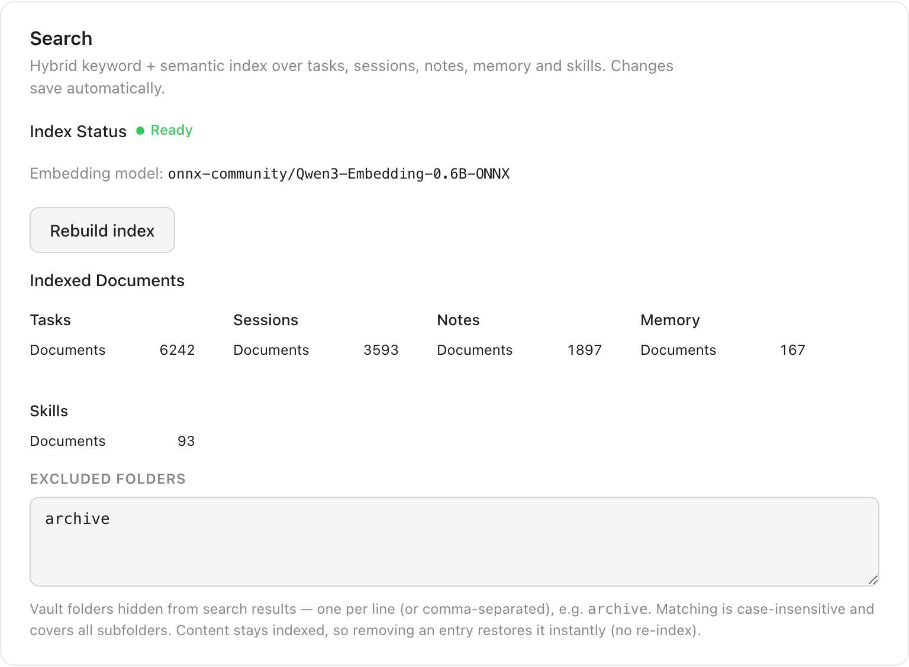

# Build, Adopt, Build Again: Seven Months of Search in a Personal AI Tool

## Introduction

[Open Walnut](https://github.com/EvanZhang008/open-walnut) is a self-hosted personal AI: tasks, notes, long-term memory, and Claude Code sessions in one web app. Over seven months we replaced its search engine twice. We wrote our own, threw it out for an open-source library, and then wrote our own again on top of two small libraries. This post covers why we changed twice, what each version measured, and how the current engine works.

Search was a core feature, and tokenization, which decides what can be found at all, was the one component the library did not let us replace. Once it moved into our code, the rest of the engine turned out to be things already in our stack. The second switch took eleven days behind a flag. The four months of patching before it cost more than that.

*Figure 1. The three engines, and why we left each one.*

## Why search is core in an AI tool

Search in a personal AI tool runs on three paths, and only one of them starts with a person typing.

- A person types into a search box while looking at a board of tasks.
- The agent calls `task_search` and `memory_notes_search` as tools while answering a question. If retrieval misses, the model answers from the rows it was handed and gets the answer wrong.
- Before every agent turn, a skill prefetch has a hard budget of 300 ms to find the relevant instructions. Miss the budget and the turn runs without them.

Our data is also messy. Today the index holds about 12,000 documents: 6,242 tasks, 3,593 session transcripts, 1,897 notes, 167 memory pages, and 93 skills. Task notes carry code identifiers like `AcmeEventOperator` and `CR-291543784`. About 31% of task titles mix Chinese and English. Queries from the logs are one to seven words, median two.

## Version 1: homegrown, first pass (February to April 2026)

The first engine was about 800 lines: SQLite FTS5 with its default tokenizer for keywords, a local Ollama process running BGE-M3 for vectors, and reciprocal-rank fusion to merge the two lists.

It worked for a while. We left it for two reasons. We wanted reranking and query expansion without building them, and Ollama was a second process the user had to install and keep running. A library that shipped all of that in one package looked like the obvious move.

## Version 2: a library (April to August 2026)

On 12 April we replaced the homegrown engine with [QMD](https://github.com/tobi/qmd) 2.1.0, an open-source local hybrid search engine: BM25, vectors, query expansion, and a cross-encoder reranker, out of the box.

The early results were good, and we ran an embedding-model comparison on top of it. A July study on an isolated copy of 3,549 tasks compared embedding models through the same hybrid path:

| Embedding model | Controlled Success@10 | Chinese | Mixed | Warm hybrid p50 |
|---|---:|---:|---:|---:|
| BGE-M3 | 25.0% | 0.0% | 15.4% | 149 ms |
| EmbeddingGemma | 72.9% | 66.7% | 69.2% | 55 ms |
| Qwen3-Embedding-0.6B | 87.5% | 75.0% | 92.3% | 56 ms |

Qwen3 became the default, and it is still the default in the current engine.

Five days after adoption, on 17 April, we shipped the first patch to the library's compiled output, applied at `npm install` time, to lift a recall cap. By August the count was 15 postinstall patches to `dist/store.js`, pinned to one version, plus 33 in-tree workarounds and about 3,700 lines of integration code across 18 files, several of them reaching into the library's private `internal.*` API.

*Figure 2. Our 15 patches and 3,700 lines of integration code all sat outside the library. The tokenizer, the AND-joined query, and the scoring were inside it.*

The operational cost grew with it:

- Four SQLite index files totalling 663 MB, the session store alone 388 MB. A full session reindex took 9.3 minutes at p50, and a pass that changed nothing still took 455 seconds.
- `/api/search` averaged 4,034 ms in production. The 300 ms skill prefetch almost never won.
- The reranker took 9.29 seconds at p50 to rerank 40 candidates. It did raise observed Recall@10 from 81.7% to 91.7%, but nothing typed into a search box can wait nine seconds, so we turned it off on every interactive path.
- The model cache reached 3.8 GB, more than half of it a reranker and a query-expansion model that were never enabled.
- Index writes took seconds and ran synchronously, so we had to fork a child process just to keep the web server's event loop alive.

None of that was a bug in the library. It was built for markdown knowledge bases, mostly in one language. Our data is code identifiers, three languages, and chat transcripts. The library did not fit our data, and each workaround added code we would have to delete when we left.

### The query we could not fix

In August a user searched `kind event operator reconciler` and could not find a task whose note was full of `AcmeEventOperator`, a camelCase component name. We traced it to three causes, all in the engine core, none reachable by a patch:

1. **The tokenizer.** FTS5 was configured with `porter unicode61`. `AcmeEventOperator` was indexed as one stemmed token, `acmeeventoper`. A run of Chinese text was indexed as one token. The query term `operator` compiled to a prefix match and could never hit either.
2. **AND annihilation.** Query terms were AND-joined. One missing term returned zero rows for the whole keyword lane, and ranking silently fell back to vectors only.
3. **Meaningless scores.** With the reranker off, the engine returned `score = 1/rank`. The number carried no term coverage and no field information, and it was not comparable across our four stores, so every merge rule on top of it was a guess.

Of the three causes, the tokenizer was the blocker: it decides which strings ever enter the index, so no ranking change above it can recover a token that was never written. It sat inside the library, hardcoded, and we had spent four months patching everything around it.

## Looking for another engine

Before writing anything, we ran a market scan with one test: does the query `operator` match a document containing `AcmeEventOperator`, without a server sidecar? We checked by live test or by reading source, at the versions available in August 2026.

- Meilisearch has a camelCase splitter in its tokenizer library, but it is not enabled in the shipped build.
- Typesense's infix search scans linearly and only uses the first query word.
- LanceDB's Rust core has a word-delimiter filter with identifier splitting; the Node binding we tested silently dropped the parameter.
- FTS5 custom tokenizers need `sqlite3_bind_pointer`, which the Node binding we use (better-sqlite3) does not expose; a pull request for it has been stalled since 2023.
- MiniSearch and a few in-process vector engines came close, but each brought its own trap: in-RAM indexes with snapshot problems, or a 216 MB native binary and the same tokenizer gap.

Nothing passed the test out of the box, so we moved tokenization into our own code, applied the same way at index time and query time. After that we only needed a store for our tokens with BM25 over them, which SQLite FTS5 already provided.

## Version 3: homegrown, second pass (August 2026 onward)

### The eval harness came first

Owning a tokenizer and a scorer means owning every regression, so we built the golden set before the engine: real queries from search history, each with assertions (`must_include`, `top1_kind`, `must_rank_above`, `must_exclude`, `max_latency_ms`), and a runner that builds a throwaway index from the real data and prints recall@10, MRR, top-1, and latency. Twenty neutralised cases live in the public repo; the rest, with real project names, stay on the author's machine and merge in locally.

The first run, against the library we were about to replace, set the baseline: recall@10 96% on 28 queries, but p50 1,017 ms and p90 1,562 ms. Twenty-seven of the twenty-eight cases took longer than the 200 ms bound, and only one case passed all of its assertions. Recall was acceptable at 96%. Latency was five times over the 200 ms bound, and the tokenizer was still inside the library.

We used the harness to decide the rest. Two of its results contradicted what we expected, and both are below.

### One tokenizer, both sides

*Figure 3. The same function runs on documents at index time and on the query at search time.*

The tokenizer is a single pass over character codes that emits two ordered streams. `orig` keeps whole lowercased tokens, including compounds with internal `-`, `_`, `.`. `sub` holds the splits: lower-to-upper, letter-to-digit, and acronym boundaries, so `AcmeEventOperator` splits after `Acme`, not after `AcmeEvent`. Chinese runs go whole into `orig` and as ordered bigrams into `sub`. No stemming.

| Input | orig | sub |
|---|---|---|
| `AcmeEventOperator` | acmeeventoperator | acme, event, operator |
| `acme-gateway-dev` | acme-gateway-dev | acme, gateway, dev |
| `修复EventOperator的bug` | 修复, eventoperator, 的, bug | 修复, event, operator, 的 |
| `CR-291543784` | cr-291543784 | cr, 291543784 |
| `getHTTPResponseCode` | gethttpresponsecode | get, http, response, code |
| `要重试3次 timeout` | 要重试, 3, 次, timeout | 要重, 重试, 次 |

A `TOKENIZER_VERSION` is stamped into the database, and a mismatch at open wipes the index and re-tokenizes from the stored raw text. A silent index/query mismatch is the main way owning a tokenizer goes wrong, so a golden-fixture unit test pins every row of that table.

It is also fast: 47.9 million characters per second, so the whole index tokenizes in a second or two. A single-document upsert takes 0.05 to 0.27 ms, so indexing moved inline into the web server and the child indexer was deleted.

### Two lanes, additive scoring, vectors that only rescore

*Figure 4. Keyword lanes retrieve about 250 candidates in 3 ms. Vectors only reorder them, behind a deadline.*

The keyword side is FTS5 in contentless mode (`content=''`, `contentless_delete=1`) over our token streams, with the raw text kept in a plain `doc` table for snippets, rescoring, and rebuilds. Two queries run per search. Lane A ANDs all `orig` tokens for precision, with Chinese as ordered-bigram phrases so `自动重试` cannot match two characters that happen to appear far apart. Lane B ORs `orig` and `sub` tokens for recall, behind a document-frequency gate: a term that appears in more than 15% of all documents stays out of the OR lane. Without the gate, in a 50,000-document stress index, one word present in every document pushed the keyword lane to 619 ms at p50, against 1 to 3 ms for ordinary queries.

Scores are a weighted sum, every component normalised to [0, 1] and exposed on the hit: 0.45 strict BM25, 0.25 relaxed BM25, 0.20 term coverage over all fields, 0.07 exact identifier, 0.03 recency, plus 0.20 cosine when the semantic lane arrives. We tried multiplicative tiers first and they broke on the real data: a long transcript matching zero query terms outranked the correct short task. Additive scores are readable off the hit, so we could tune each weight against the golden set.

Vectors never retrieve. They only reorder the roughly 250 candidates the keyword lanes found. Two measurements forced this. A full nearest-neighbour scan over every chunk vector took about 7 seconds in JavaScript, and 132 ms at p50 through a SQLite vector extension over the session store alone; cosine over 250 candidates takes 0.1 ms. And every embedding model we tried put `CR-291543784` and `CR-291543785` at cosine 0.92 to 0.97, because digits tokenize into pieces and mean pooling erases the difference. Exact identifiers therefore get their own lookup before either lane runs, and the keyword lanes stay in charge of what gets found.

The query embedding runs in a `worker_thread` on ONNX, int8, and races a deadline. Past the deadline, the keyword order ships with a `semantic: 'timeout'` marker. Leave the embedder out entirely and the same code is a pure keyword engine with no native dependency beyond SQLite. The degraded mode is a supported way to run it, and it is what our cloud replica does.

### The model decision, made twice by the harness

We started with multilingual-e5-small: 1.88 ms per query embed, 1.3 s to load, 384 dimensions, 118 MB. The first golden run looked fine. Then we expanded the set with queries written the way people actually type (short, misspelled, camelCase split by hand, Chinese asking for English titles) and recall@10 fell to 72%.

An A/B through the same harness measured the difference: Qwen3-Embedding-0.6B in ONNX form raised recall@10 from 70% to 80% and MRR from 0.56 to 0.62, fixing seven failing cases, at 24 ms per query embed. Passage embedding is about 30 times slower, but only the paced background backfill pays that. This is the same model the July study picked, now running through ONNX instead of a GGUF runtime. Ranking fixes on the same harness then took the set to 90%.

## What happened

The new engine went on by default on 26 August, four days after it landed behind a flag next to the old one. The old engine stayed one more week behind an environment variable as the rollback path. On 2 September the library, its 15 patches, the 3,700 lines of glue, the forked indexer, and the four index files were deleted. The current offline baseline on 72 real queries: recall@10 90%, MRR 0.74, top-1 91%, p50 71 ms, p90 125 ms. The keyword index is 52 MB in one file instead of 663 MB in four. The web server process dropped from about 4.8 GB resident to 1.7 GB and stopped burning a core at idle.

*Figure 5. The index status panel after the switch.*

The new engine is about 3,900 lines including the embed worker and the adapter that feeds it tasks, sessions, notes, memory, and skills. That is roughly the same line count as the glue we deleted, except it is the engine itself, so the tokenizer and the scoring are now ours to edit.

The new engine produced two production incidents.

**The vector table was empty for days and nothing said so.** After a schema migration wiped the vectors, the background backfill needed two to four hours, and on a day with frequent deploys it never finished. A shutdown short-circuit logged "backfill drained" every restart. Semantic search ran in its keyword fallback the whole time and looked merely mediocre. Three fixes: the backfill now embeds the light kinds (notes, memory, tasks) before the thousands of chunked session transcripts, so a restart no longer pushes them to the back of the queue; a `busy_timeout`, because a diagnostic script touching the database had been aborting backfill writes with "database is locked"; and a rule we now apply before any "semantic search is bad" report: count the rows in `doc_vec` first.

**A single embed worker was blocked by its own backfill.** CPU inference is linear in batch size: one 2 KB passage took about 540 ms, a batch of 32 took 22 seconds. Batching bought nothing except a 22-second queue in front of every query embed, so every query missed its 150 ms deadline and silently shipped the keyword order. Backfill now embeds one passage at a time and yields whenever a query arrived in the last 2.5 seconds. Query p50 went from 220 ms to 107 ms.

Both incidents had the same shape: a deadline fallback fired on nearly every query and nothing counted it, so the degraded path looked like slightly worse ranking. Every query now increments a counter labelled with its semantic state (`ok`, `cold`, `timeout`, `skipped`, `disabled`), so a day of timeouts shows up in the metrics as a count.

## Where the LLM fits

Keyword and vector lanes do not cover everything. For hard questions ("which task was about the side question feature, I think I misspelled it"), we added a third lane: a small Claude subprocess that runs several searches through the same API, reads the compact rows, and judges them by meaning rather than by string similarity. It returns up to five candidates with a reason for each. It takes four to nine seconds for simple questions, so it sits behind its own panel, not on the keystroke path. It depends on the keyword lanes, because it can only rank the rows those searches return.

## Lessons learned

- **If a feature is core to your product, own the part that decides its behaviour.** For search that part is tokenization. After fifteen patches we still could not change it.
- **Check a library's core assumptions against your data before its feature list.** Ours was built for one-language markdown. We fed it code identifiers, three languages, and chat transcripts.
- **Build the eval harness before the engine.** The model choice, the lane design, the score weights, and two rollbacks were all decided by numbers from a 72-query golden set. We expected the smaller model and multiplicative scores to win, and both lost.
- **Vectors alone get identifiers wrong.** Every model we tried scored `CR-291543784` and `CR-291543785` at cosine 0.92 to 0.97, so exact identifiers need a keyword path.
- **Use vectors to rescore keyword candidates, not to retrieve.** At tens of thousands of documents, cosine over about 250 candidates is thousands of times cheaper than a full scan and recall@10 stayed at 90%.
- **Count every deadline fallback.** Two silent degradations lasted days because the fallback looked like slightly worse ranking.
- **Keep the keyword path free of native dependencies so it can be the degraded mode.** The same code runs on machines without an embedding model.
- **Replacing the engine cost less than we expected.** Eleven days behind a flag, against four months of patching. Each of the three engines was a reasonable choice at the time; keeping the second one longer would not have been.

## Where to start

If you are adding search to an AI tool of your own: start with SQLite FTS5 and a tokenizer you wrote, applied on both sides. Write twenty golden queries from your real search history before you tune anything. Add vectors as a rescorer over keyword candidates, in a worker, behind a deadline with a counter. Measure on your own data, because published benchmarks were run on other people's.

The engine described here lives in the Open Walnut repository under `src/lib/hybrid-search/`, written as a self-contained library with its own README. The investigation notes, including the library-era performance study and the market scan, are under `docs/investigation/`.
