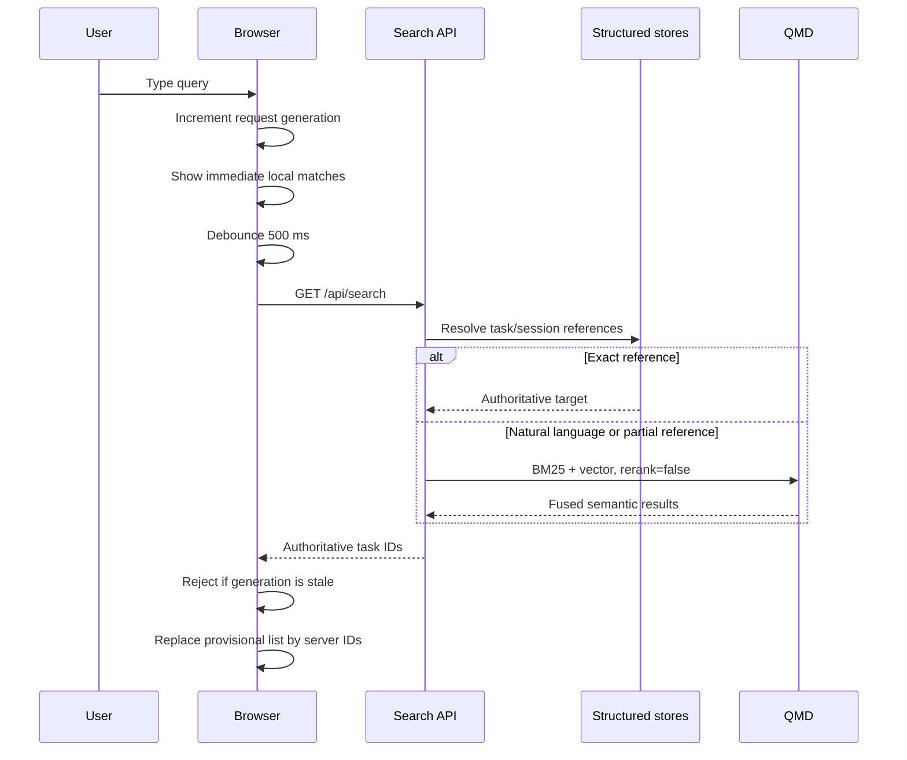

# Implementation

## Split Search Architecture

Interactive and agent search have different latency budgets:

```text
Interactive UI
  -> structured reference lookup
  -> QMD BM25 + vector fusion
  -> no reranker
  -> authoritative task IDs

Agent tools
  -> structured reference lookup
  -> QMD BM25 + vector fusion
  -> QMD default reranker
  -> multi-query result merge
```

The split is explicit rather than controlled by a global setting.

## Interactive Request Flow



The browser does not merge unrelated provisional tasks into the final server
result. It maps authoritative server IDs back to the loaded task objects.

Relevant code:

- [`web/src/hooks/useTaskSearch.ts`](../../../web/src/hooks/useTaskSearch.ts)
- [`web/src/components/tasks/search-results.ts`](../../../web/src/components/tasks/search-results.ts)
- [`src/core/search.ts`](../../../src/core/search.ts)

## Structured Reference Lookup

The reference resolver checks:

- task ID;
- active session ID;
- historical session IDs;
- plan session ID;
- execution session ID;
- external task URL; and
- standalone session records.

When task-side session links are stale, `SessionRecord.taskId` is authoritative.
That prevents a stale local task owner from winning over the session database.

Exact references return before semantic search. Partial references remain
pinned first and can still merge semantic matches.

Tests:

- [`tests/web/routes/search-reference-bypass.test.ts`](../../../tests/web/routes/search-reference-bypass.test.ts)
- [`tests/web/task-search-results.test.ts`](../../../tests/web/task-search-results.test.ts)

## Why IDs Are Not Embedded

Task QMD content includes:

- title;
- description;
- summary;
- tags;
- category and project;
- note; and
- conversation log.

Session QMD content includes:

- summary or gist;
- title, description, and plan content;
- linked task description and summary;
- project, working directory, and host metadata; and
- filtered local conversation turns when available.

Opaque task and session IDs are deliberately excluded from embedding text. QMD
virtual paths preserve identity:

```text
task-<task-id>
sess-<session-id>
```

This avoids vector noise and prevents a session-link update from changing the
content hash and forcing an unnecessary re-embed.

Relevant code:

- [`src/core/qmd-task-sync.ts`](../../../src/core/qmd-task-sync.ts)
- [`src/core/qmd-session-sync.ts`](../../../src/core/qmd-session-sync.ts)

## Reranker Policy

The core search helper defaults to reranking. Callers must opt out.

Interactive task and session search passes:

```typescript
{ rerank: false, overfetchMultiplier: 1 }
```

Agent `task_search` and `memory_notes_search` do not pass `rerank: false`, so
they retain the QMD default. Contract tests prevent an accidental global
removal.

Relevant code:

- [`src/core/memory-search.ts`](../../../src/core/memory-search.ts)
- [`src/agent/tools.ts`](../../../src/agent/tools.ts)
- [`src/agent/tools/memory-notes-search-tool.ts`](../../../src/agent/tools/memory-notes-search-tool.ts)
- [`tests/agent/search-rerank-contract.test.ts`](../../../tests/agent/search-rerank-contract.test.ts)

## Model Selection and Compatibility

Walnut's default is:

```text
hf:Qwen/Qwen3-Embedding-0.6B-GGUF/
Qwen3-Embedding-0.6B-Q8_0.gguf
```

EmbeddingGemma remains a compact preset. An explicit `QMD_EMBED_MODEL`
environment variable has precedence over the saved Walnut setting.

Model switching is applied through Download/Re-index. The store validates both:

- persisted model metadata; and
- physical vector dimensions.

Qwen3 uses 1,024 dimensions and EmbeddingGemma uses 768. A mismatch rebuilds
the store instead of allowing incompatible query and document vectors.

Relevant code:

- [`src/core/qmd-model.ts`](../../../src/core/qmd-model.ts)
- [`src/core/qmd-store.ts`](../../../src/core/qmd-store.ts)
- [`tests/core/qmd-store-model.test.ts`](../../../tests/core/qmd-store-model.test.ts)
- [`tests/core/qmd-store-dimensions.test.ts`](../../../tests/core/qmd-store-dimensions.test.ts)

## Concurrency and Memory

Walnut has separate read and mutation behavior:

```text
ordinary search
  -> short read lease
  -> concurrent SQLite WAL snapshot

index update / embedding pass
  -> shared mutation tail
  -> one model-heavy mutation at a time

model switch
  -> stop new reads
  -> drain active readers
  -> close/reopen stores
  -> release reads
```

Serializing index work prevents multiple embedding model copies from loading
at once. Ordinary searches are not serialized because a stale slow query must
not block the current query.

Relevant code:

- [`src/core/qmd-work-queue.ts`](../../../src/core/qmd-work-queue.ts)
- [`tests/core/qmd-work-queue.test.ts`](../../../tests/core/qmd-work-queue.test.ts)

Physical deletion, worker ownership, and database compaction are documented in
[Index maintenance](06-index-maintenance.md).

## Failure Semantics

- If semantic search is disabled, interactive search uses the local BM25 path.
- If one QMD source fails, search can use the source-specific fallback.
- A total QMD failure is not silently converted into an authoritative empty
  result, because that would make an infrastructure failure look like "no
  matches."
- Superseded responses are ignored regardless of whether browser abort reaches
  the server in time.

## Invariants

Future changes should preserve these constraints:

1. Do not restore reranking in keystroke-driven UI search without measured
   latency and a material quality improvement.
2. Do not remove reranking from agent tools based on the UI latency budget.
3. Do not globally serialize normal search reads.
4. Do not embed opaque identifiers to implement copied-reference navigation.
5. Do not accept a semantic response for an older input generation.
6. Do not switch embedding models without rebuilding incompatible vectors.
7. Do not report controlled Success@10 as production recall.
